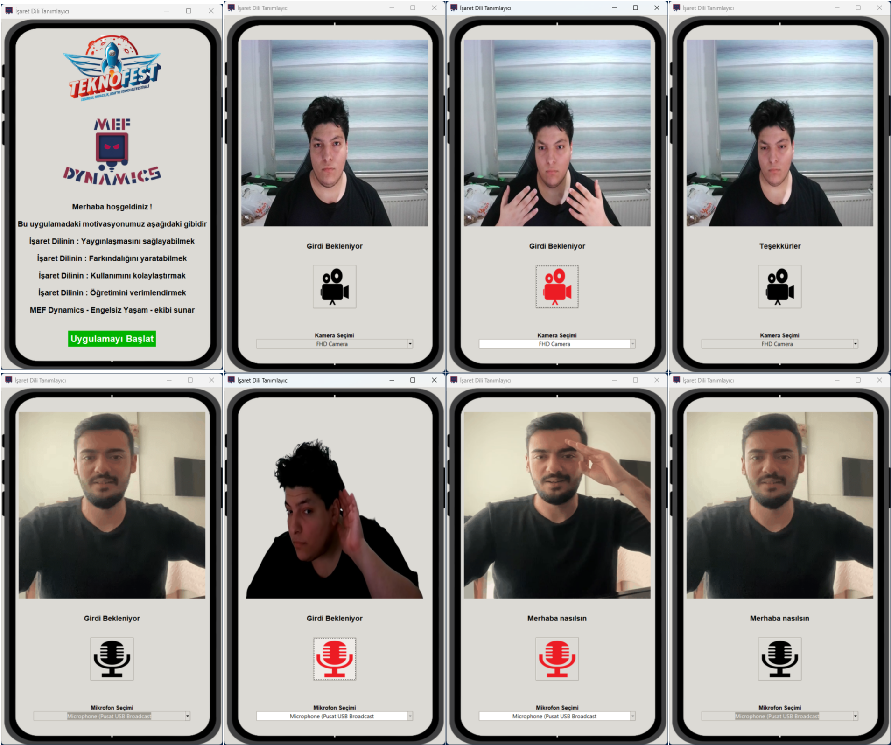

# Sign-Language-Application

### Description
* This is a sign language application with features that helps disabled people to comminucate with others.

### Our Motivations
* Application motivations ;
    - Sign Language: To be able to make it widespread
    - Sign Language: Creating Awareness
    - Sign Language: Making it easy to use
    - Sign Language: Teaching efectively

### Features
* Application constructed %100 python structure with Python Language and pythonist modules.
* Application also able to run predictions though the KeyMaps shown in ../Assets/Readme/Key Map.png file. Saved for future use.
* Application provides features such as ;
    - Speech to text
    - Text to speech
    - Text Translation
    - Speech Recognition
    - Speech Synthesis
    - Image Recognition
    - Sign Language Recognition
    - Sign Language Synthesis
    - Graphical User Interface

### Structure
* Application is divided into two parts ;
    - Detecting Sign Language
    - Detecting Speech
* Application is seperated into utilitiy methodsi that runs down the program much more effectively with threads and processes. Some of the utility method used in the application are ;
    - @translate_text
    - @vocalize_text
    - @listen_text
    - @detect
* Application is constructed with a dynamical structure that can be easily modified and updated with only one line change for all other thanks to ../Constants/path_track.py file.
* Application is served with tkinter library for graphical user interface.

### Installation
>Application DOES requires CUDA and CUDNN to be installed on your computer ! From scratch you can follow installation steps, that also includes CUDA installation.\
>You can also see the specific quedlines via @"Wired Installation.txt" from ../Assets/Readme/ folder.\
>Application is reserved on a machine with RTX 3060 Laptop GPU and python 3.10.0 version.\

* Required Pre-Installation Steps
    * `install visual studio 2022 via website`
    * `install the cuda12 from nvidia installer`
* Environment Setup
    * `conda create -n sign_app python==3.10.0`
    * `conda activate sign_app`
* PIP and Conda installation Steps
    * `conda install -c conda-forge cudatoolkit=11.2 cudnn=8.1.0`
    * `python -m pip install "tensorflow<2.11"`
    * `pip install mediapipe==0.9.0.1`
    * `pip install opencv_python-4.7.0.68`
    * `pip install playsound==1.2.2`
    * `pip install SpeechRecognition==3.9.0`
    * `pip install googletrans==3.1.0a0`
    * `pip install gTTS==2.3.1`
    * `pip install pyaudio==0.2.13`
    * `pip install pygrabber==0.1`

### Usage

* Application is ready to use after installation steps.

* After the "Main Menu" window the two Applications will be available to use in order.

* To Run :
    * `conda activate sign_app`
    * `python main.py`

### Example Of Usage

### TO:DO
- [ ] Enable World-Wide language support (Structure is ready, just implement it)
- [ ] Enable for different types of sign languages (Structure is ready, just implement it)
- [ ] Collect More data for model.
- [ ] Collect More animation gifs.
